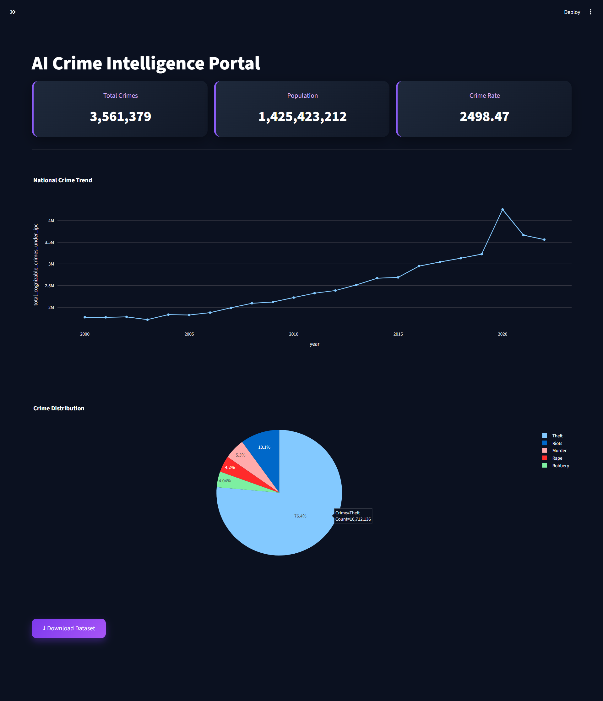
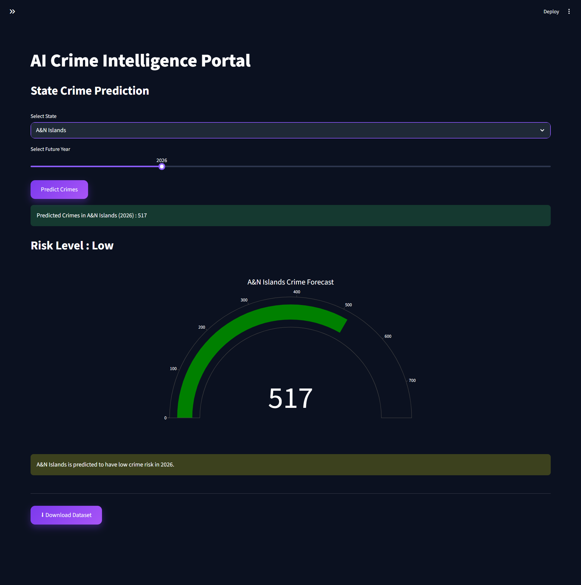
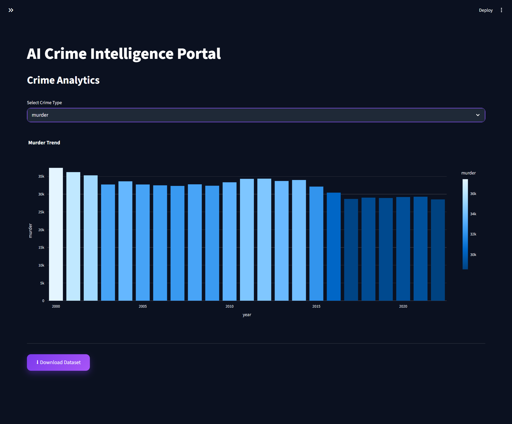
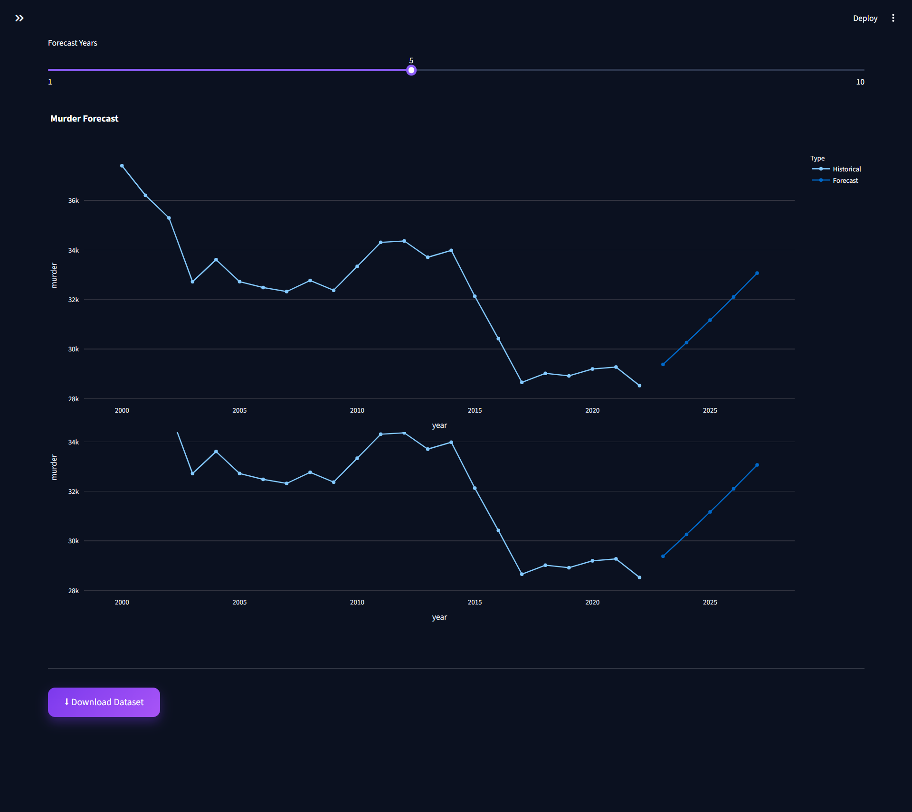
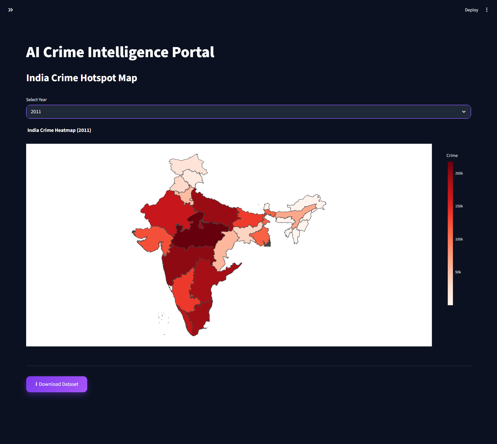
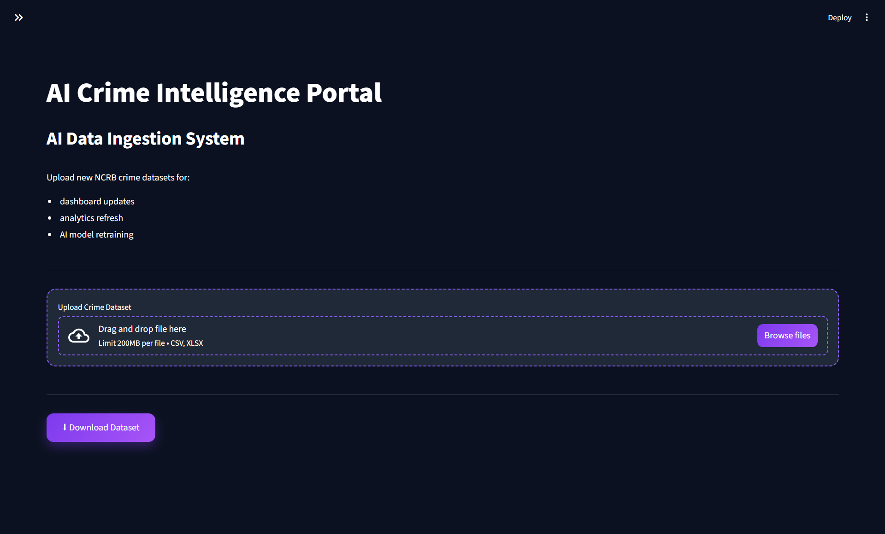

<div align="center">

# 🛡️ AI Crime Intelligence Portal

### AI-Powered Crime Prediction & Analytics Platform

Interactive Streamlit application for predicting crime trends, forecasting future crime levels, visualizing crime statistics, and analyzing historical NCRB data using Machine Learning.

<br>

🌐 **Live Demo**  
https://ai-crime-predictive-analysis.streamlit.app/

💻 **Website Repository**  
https://github.com/sanjanadwivedi/crimevision-ai-website

💻 **AI Platform Repository**  
https://github.com/sanjanadwivedi/AI-Crime-Intelligence-Portal

<br>
💻 **GitHub Repository:** https://github.com/sanjanadwivedi/AI-Crime-Intelligence-Portal

An AI-powered web application that analyzes historical crime data, predicts future crime trends, and visualizes crime statistics through interactive dashboards and maps.


</div>

---

# 📸 Dashboard Preview

<p align="center">

</p>

---

# 🚀 Overview

The AI Crime Intelligence Portal is a Machine Learning-powered web application that enables users to analyze historical NCRB crime data, predict future crime trends, and explore interactive visualizations through an intuitive dashboard.

The platform combines AI-based prediction with analytics, forecasting, and geospatial heatmaps to provide meaningful crime insights for researchers, students, and decision-makers.

---

# ✨ Features

- 🔐 Secure Demo Login
- 📊 Interactive Crime Dashboard
- 🤖 AI Crime Prediction
- 📈 Crime Forecasting
- 📉 Crime Analytics
- 🗺️ India Crime Heatmap
- 📂 Admin Dataset Upload
- 💾 Download Processed Dataset
- 🌙 Modern Dark Theme UI

---

# 🧠 Machine Learning Workflow

- Data Collection
- Data Cleaning
- Feature Engineering
- Model Training
- Prediction
- Interactive Visualization

---

# 🚀 Tech Stack

| Category      | Technologies              |
| ------------- | ------------------------- |
| Backend       | Python                    |
| Framework     | Streamlit                 |
| ML            | Scikit-Learn, CatBoost    |
| Data          | Pandas, NumPy             |
| Visualization | Plotly, Folium            |
| Deployment    | Streamlit Community Cloud |

---

# 📂 Project Structure

```text
crime-project-portal/

├── app_streamlit.py
├── train_model.py
├── requirements.txt
├── README.md
├── india_states.geojson
├── state_name_map.json

├── data/

├── models/

├── screenshots/
```

---

# 📊 Dataset

The application uses NCRB (National Crime Records Bureau) crime datasets covering multiple years.

Included crime categories:

- Murder
- Theft
- Robbery
- Burglary
- Kidnapping
- Rape
- Riots
- Dowry Deaths
- Other IPC Crimes

These datasets are used for visualization, forecasting, and AI-based crime prediction.

---

# 🌐 Related Project

This AI platform is part of the **CrimeVision AI** ecosystem.

Official Landing Website:

https://github.com/sanjanadwivedi/crimevision-ai-website

The website provides:

- Premium landing page
- Product overview
- Platform modules
- Workflow explanation
- Direct launch into the AI application

---

# ⚙️ Installation

Clone repository

```bash
git clone https://github.com/sanjanadwivedi/AI-Crime-Intelligence-Portal.git
```

Install dependencies

```bash
pip install -r requirements.txt
```

Run

```bash
streamlit run app_streamlit.py
```

---

# 📷 Application Screenshots

## Login


---

## Dashboard


---

## AI Prediction



---

## Crime Analytics



---

## Forecasting



---

## Heatmap



---

## Admin Panel



---

# 🎯 Future Enhancements

- Multi-user authentication
- Real-time crime data integration
- Advanced forecasting models
- AI chatbot assistant
- Automated PDF reports
- Cloud database integration

---

# 👩‍💻 Developer

**Sanjana Dwivedi**

Computer Science Undergraduate

Passionate about Artificial Intelligence, Data Analytics, Machine Learning, and Full-Stack Development.

---

<div align="center">

### ⭐ If you found this project useful, consider giving it a star!

Built with ❤️ using Python, Streamlit & Machine Learning.

</div>
